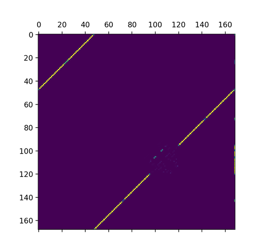

nupyck
======
`nupyck` is python frontend to [NUPACK](http://nupack.org), the
nucleic acid package. It has been designed to be familiar
to users of NUPACK, while also presenting a more powerful interactive interface.

Instead of calling NUPACK's executables via the shell, `nupyck` includes
a version of NUPACK compiled as a shared library, which is called directly
from python using `ctypes`.

Table of Contents:
1. [Basic Usage](#basic-usage)
    1. [Options](#options)
    2. [`pfunc`](#pfunc)
    3. [`pairs`](#pairs)
    4. [`concentrations`](#concentrations)
    5. [`mfe`](#mfe)
2. [Advanced Usage](#advanced-usage)
    1. [Parallel Jobs](#parallel-jobs)
    

### Basic Usage
`nupyck` currently exposes four "applications" from the NUPACK suite:
`pfunc`, `pairs`, `concentrations`, and `mfe`. Each of these takes input
similar to their NUPACK counterparts.

#### Options
Common to all four applications is an `Options` object. The defaults are
the same as NUPACK's:

```python
import nupyck

opts = nupyck.Options(
    material=nupyck.RNA,        # | nupyck.DNA
    na=1.0,                     # sodium concentration
    mg=0.0,                     # magnesium concentration
    pseudo=False,               # calculate pseudoknots (only for RNA)
    dangles=nupyck.SOME_DANGLES # | nupyck.NO_DANGLES | nupyck.ALL_DANGLES
)

# or equivalently, because all of the above are defaults:
opts = nupyck.Options()

# or, just set one option:
opts = nupyck.Options(material = nupyck.DNA)
```

#### `pfunc`
The input's to nupyck's `pfunc` application are the same as to NUPACK's:
a list of sequences, a 1-indexed permutation of those sequences, the
temperature, and other options. For example, consider the following
example from the NUPACK documentation:

```python
import nupyck

sequences = [
    "AGTCTAGGATTCGGCGTGGGTTAA",
    "TTAACCCACGCCGAATCCTAGACTCAAAGTAGTCTAGGATTCGGCGTG",
    "AGTCTAGGATTCGGCGTGGGTTAACACGCCGAATCCTAGACTACTTTG"
]

permutation = [1, 2, 2, 3]

options = nupyck.Options(material = nupyck.DNA)

result = nupyck.pfunc(sequences, permutation, temp = 23, options = options)

print result
```

The result is a python dictionary containing entries for `energy` and `pfunc`,
so the above code produces the following output:
```python
{'energy': -121.97280668378544, 'pfunc': 1.02444390480969e+90}
```

#### `pairs`
The inputs to `nupyck.pairs` are the same as to `nupyck.pfunc`. In addition to
`energy` and `pfunc`, the result dictionary also contains `ppairs`, which
is a numpy matrix where `ppairs[i,j]` is the probability of the i-th base
pairing with the j-th base of the ordered complex. `ppairs[i,-1]` is the
probability that the i-th base is unpaired.

The `ppairs` matrix can be used to produce an image similar to that made
by the [nupack.org](http://nupack.org) analysis tools. Using the same
variables as above:
```python
import matplotlib.pyplot as plt

result = nupyck.pairs(sequences, permutation, temp = 23, options = options)

plt.matshow(result['ppairs'])
```


**Note**: `nupyck.pairs` does not currently return the `epairs` output
of NUPACK, nor does it implement pair calculation with pseudoknots. These
features may be implemented in a later version of `nupyck`.

#### `concentrations`
Whereas NUPACK's `concentrations` app requires you to run `complexes` first,
`nupyck.concentrations` simply takes as input a list of sequences, a vector
of initial concentrations for each of them, and a maximum complex size. It then
returns the final concentrations of all possible species up to that size.

The result is a python dictionary with entries for `concentrations`
and `energies`. Each of these is a dictionary indexed by the permutation of the
ordered complex. For example, with `sequences` and `options` defined as in
previous examples:

```python
result = nupyck.concentrations(
    sequences,
    x0 = [1e-6, 1e-6, 1e-6],
    max_complex_size = 3,
    temp = 23,
    options = options
)
print sorted(result['concentrations'].keys())
print result['concentrations'][1,2,3]
```
This outputs (line breaks added for clarity):
```python
[ (1,),
  (1, 1), (1, 1, 1), (1, 1, 2), (1, 1, 3),
  (1, 2), (1, 2, 2), (1, 2, 3),
  (1, 3), (1, 3, 3),
  (2,),
  (2, 2), (2, 2, 2), (2, 2, 3),
  (2, 3), (2, 3, 3),
  (3,),
  (3, 3), (3, 3, 3)
]
7.66711549256424e-07
```

String names can also be assigned to each sequence. This will cause the
complexes to be indexed by the name of each sequence in the complex,
joined with "-".
For example:
```python
result = nupyck.concentrations(
    sequences,
    names = ["A", "B", "C"],
    x0 = [1e-6, 1e-6, 1e-6],
    max_complex_size = 3,
    temp = 23,
    options = options
)
print sorted(result['concentrations'].keys())
print result['concentrations']["A-B-C"]
```
This outputs (line breaks added for clarity):
```python
[ 'A',
  'A-A', 'A-A-A', 'A-A-B', 'A-A-C',
  'A-B', 'A-B-B', 'A-B-C',
  'A-C', 'A-C-C',
  'B',
  'B-B', 'B-B-B', 'B-B-C',
  'B-C', 'B-C-C',
  'C',
  'C-C',
  'C-C-C'
]
7.66711549256424e-07
```

#### `mfe`

### Advanced Usage

#### Parallel Jobs
